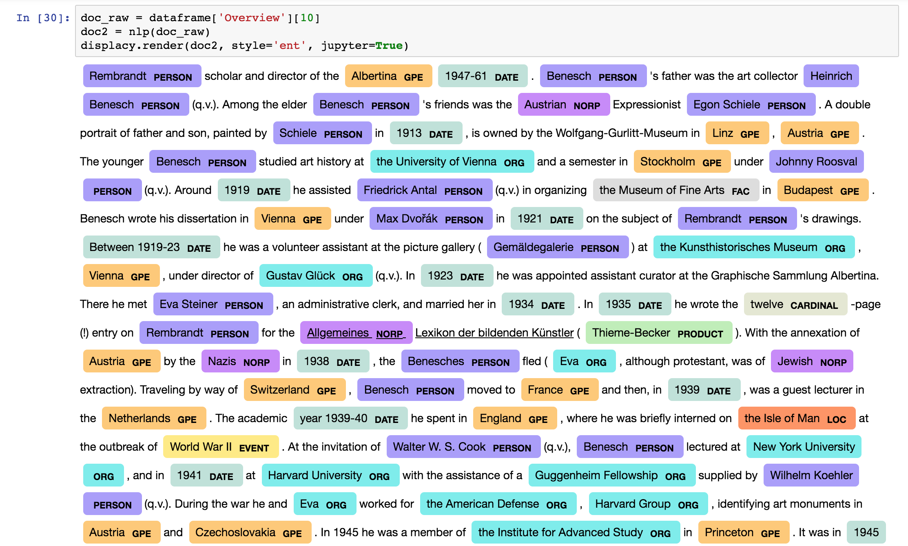
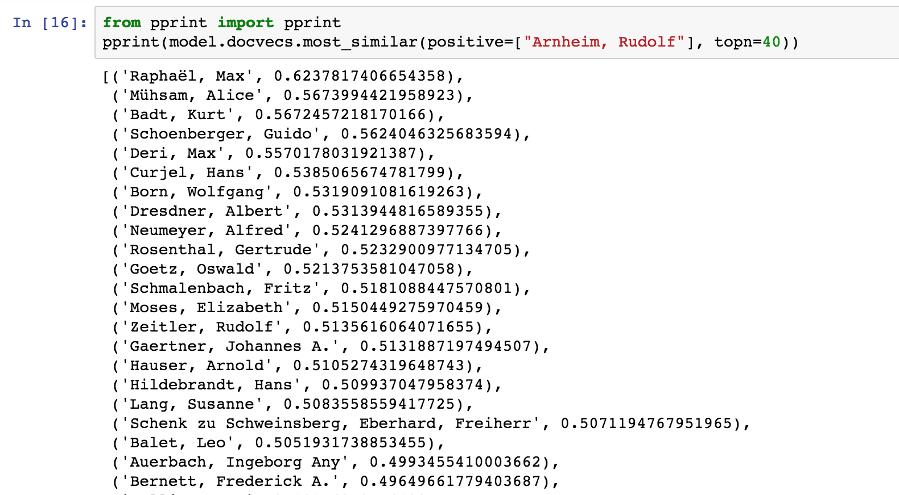

# Database of Art Historians Initial Research
> Database of Art Historians Project Initial Topic Modeling and Clustering Setup





## Installation

Setup the Application:

```sh
cd database_art_historians_research
jupyter notebook
```

## Release History
* 0.0.1
    * Work in progress

## Meta

Distributed under the MIT license. See ``LICENSE`` for more information.

[https://github.com/dukewired/database_art_historians_research](https://github.com/dukewired/database_art_historians_research/)

## Contributing

1. Fork it (<https://github.com/dukewired/database_art_historians_research/fork>)
2. Create your feature branch (`git checkout -b feature/fooBar`)
3. Commit your changes (`git commit -am 'Add some fooBar'`)
4. Push to the branch (`git push origin feature/fooBar`)
5. Create a new Pull Request
